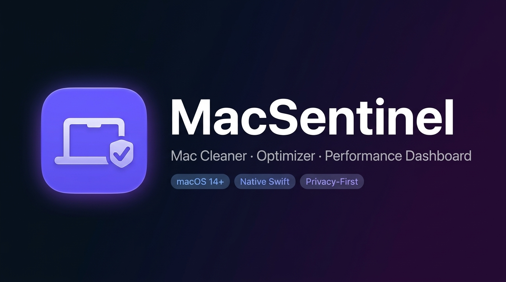
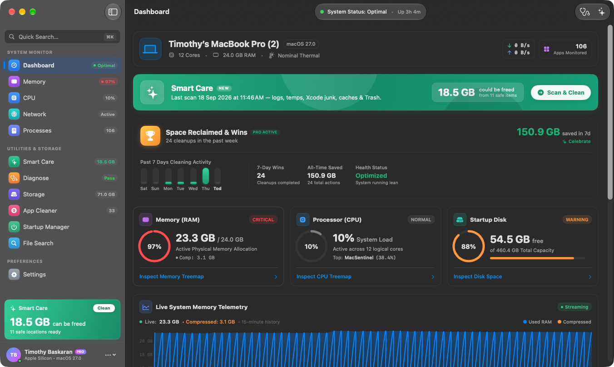
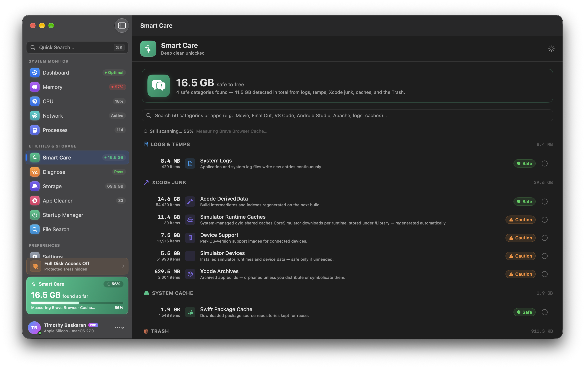
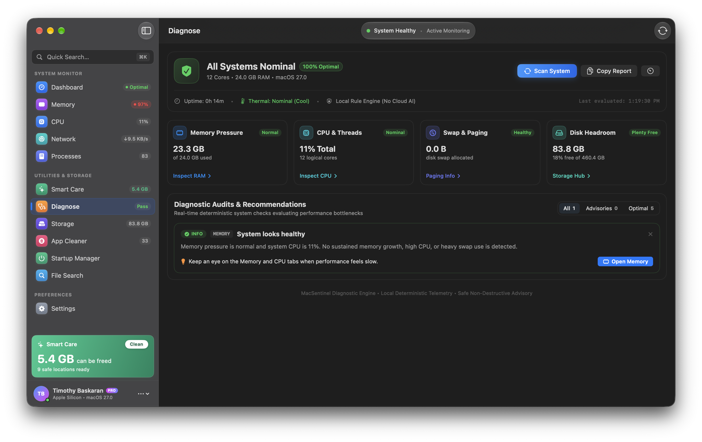
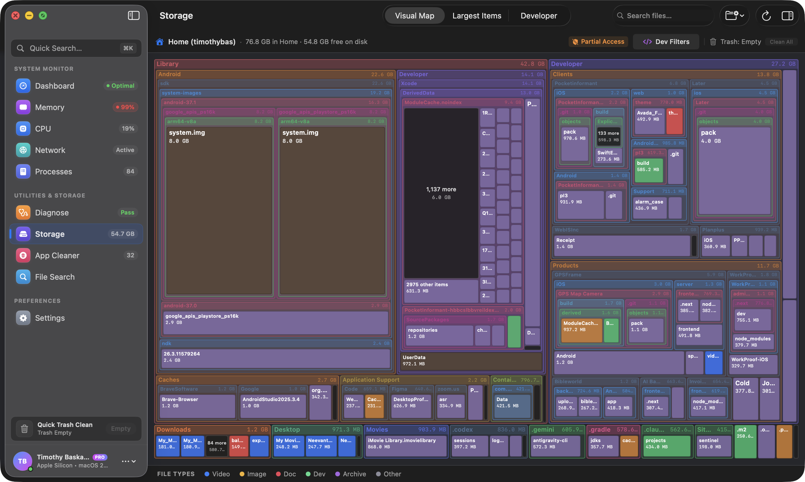
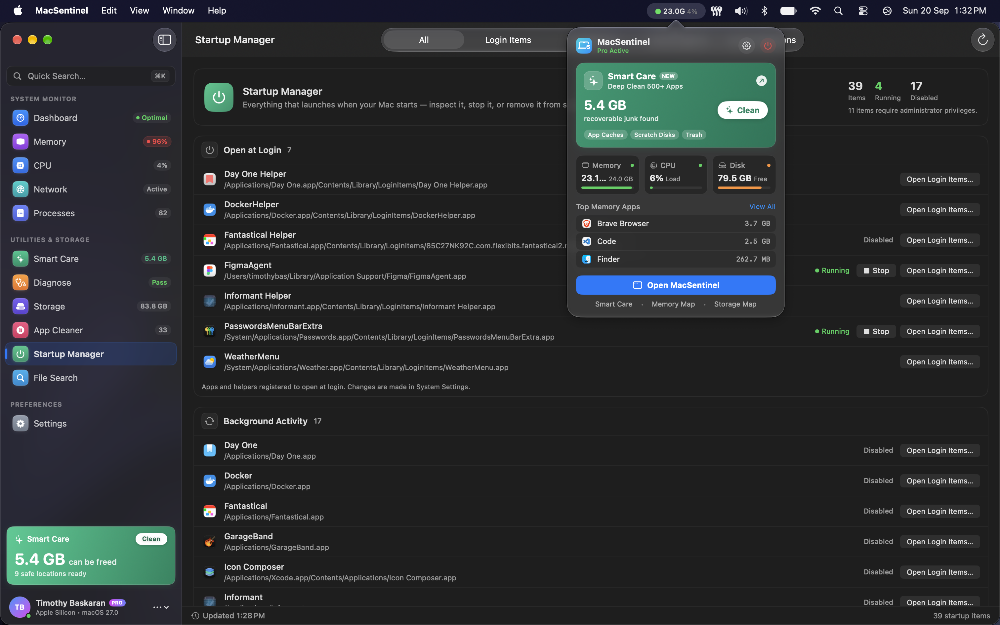

  

  

  
  
  

  
  
  
  
  

  <strong>Free up disk space · Clear hidden app caches · Speed up a slow Mac 
  Understand what's eating your storage — all in one native macOS app.</strong>

  <a href="#-see-macsentinel-in-action">Demo</a> ·
  <a href="#-flagship-feature-smart-care-deep-clean">Features</a> ·
  <a href="#-free-vs-pro">Free vs Pro</a> ·
  <a href="#%EF%B8%8F-safety--privacy">Privacy</a> ·
  <a href="#-faq">FAQ</a> ·
  <a href="https://sentinel.digital/download">Download</a>

---

## 🎥 See MacSentinel in Action

  
   
  <em>▶ Watch how MacSentinel finds hidden junk, analyzes your Mac, and safely reclaims storage.</em>

---

## 🖥️ MacSentinel at a Glance

  
   
  <em>Real-time view of memory, CPU, network, disk, and process activity — all in one native dashboard.</em>

---

## 🚨 Does Your Mac Suffer From Any of These?

| Symptom | Cause |
|---|---|
| ⚠️ **"Your disk is almost full"** | Hidden app caches, render files & build artifacts |
| 🐌 **Slow Mac, slow startup** | Background bloat, login item overload |
| 🎬 **Final Cut / Premiere / DaVinci** | Render scratch disks growing into 10s of GBs |
| 💻 **Xcode / Docker / Android Studio** | Gigabytes of DerivedData & build junk |
| 📦 **Homebrew / npm / pip / Gradle** | Package caches you'll never use again |
| 🔒 **Fear of cleaning** | Worried a cleaner will delete your real files |

**If any of these sound familiar, MacSentinel was built for you.**

---

## ✨ Why MacSentinel Is Different

Most Mac cleaners only reach system temp files and Safari history. Others show scary numbers and leave you guessing.

MacSentinel connects **monitoring → diagnosis → cleanup** into one safe, transparent workflow:

<table>
<tr>
<td align="center" width="33%">
<h3>👁 See It</h3>
Live memory, CPU, network, disk & process activity in a beautiful native dashboard
</td>
<td align="center" width="33%">
<h3>🩺 Understand It</h3>
On-device diagnostics explain <em>exactly why</em> your Mac feels slow
</td>
<td align="center" width="33%">
<h3>🔥 Fix It</h3>
Deep-clean hidden junk across 50 categories & 500+ apps, safely
</td>
</tr>
</table>

---

## 🔥 Flagship Feature: Smart Care Deep Clean

  
   
  <em>The best Mac junk cleaner for professional workflows — reaching caches generic cleaners never touch.</em>

MacSentinel's Deep Clean reaches the multi-gigabyte cache, scratch-disk, and build-artifact folders that generic cleaners never touch:

- 📂 **50 industry categories** — Video Editing, Audio DAWs, Developer Tools, IDEs, Web Servers, Databases, Containers, 3D & CAD, Design, AI/ML, Gaming, and more
- 📦 **500+ handcrafted app rules** — Final Cut Pro, DaVinci Resolve, Adobe Premiere, Photoshop, After Effects, Logic Pro, Xcode, Android Studio, VS Code, JetBrains, Docker, Homebrew, Apache, Nginx, PostgreSQL, Figma, Sketch, Slack, Teams, Chrome, Ollama, Blender, Unity…
- 🔍 **Instant search & live filtering** — type `finalcut`, `vscode`, `apache`, `logs`, or `cache` to find exactly what's wasting space
- ⚡ **Byte-accurate live scan** — full itemized breakdown in under 2 seconds
- 🆓 **Free scan** shows your full breakdown with no limits

### Reclaim Space From the Usual Suspects

| Category | Apps That Silently Eat Your Disk |
|---|---|
| 🎬 Video & Post | Final Cut Pro, DaVinci Resolve, Premiere Pro, After Effects, CapCut |
| 🎧 Audio & Music | Logic Pro, GarageBand, Ableton Live, Pro Tools, FL Studio |
| 💻 Developer & IDE | Xcode DerivedData, Android Studio, VS Code, JetBrains, Cursor |
| 🐳 Containers & VMs | Docker, Colima, OrbStack, Parallels, VirtualBox, UTM |
| 🌐 Servers & DBs | Apache/httpd, Nginx, Caddy, PostgreSQL, MySQL, Redis, MongoDB |
| 🎲 3D & Design | Blender, Cinema 4D, Photoshop, Illustrator, Figma, Sketch |
| 🤖 AI & Data Science | Ollama, LM Studio, Jupyter, Anaconda, PyTorch, Hugging Face |
| 📦 Package Managers | Homebrew, npm, Yarn, pnpm, pip, Gradle, Maven, CocoaPods |
| 🎮 Gaming | Steam, Epic Games, Battle.net, Minecraft, game shader caches |
| 🗨️ Messaging & Video | Slack, Discord, Teams, Zoom, Telegram, Skype |

---

## 🩺 "Why Is My Mac Slow?" — Diagnostics

  
   
  <em>MacSentinel doesn't just say your Mac is slow — it identifies the exact cause.</em>

- 🔒 Rule-based analysis runs **completely on-device** — nothing is sent to any server
- 🔎 Detects memory pressure, CPU saturation, runaway background apps, low storage headroom, and thermal throttling
- 💡 Clear recommendations with **one-click fixes** for Pro users

---

## 🖥️ The Complete Mac Health Suite

### 📊 Live System Dashboard

  

- **Memory pressure & swap usage** monitoring with historical trends
- **CPU utilization** and heavy-process detection
- **Live network throughput**, active interfaces, VPN recognition
- **Process & app grouping** so you see exactly who's doing what

---

### 🗄️ Visual Storage Analyzer

  

- Full Mac, Home, and custom-folder **storage scans**
- Interactive **treemap** plus largest-files and largest-folders views
- File search with quick filters for **large files, archives, media, and apps**
- Full Disk Access guidance when macOS limits visibility

---

### 🗑️ App Uninstaller & Leftover Cleanup

  

- Fully remove apps *and* their containers, caches, preferences, and support files
- Find **orphaned leftovers** from previously deleted apps
- Recoverable Trash-based uninstall with explicit preview

---

### 🚀 Startup Manager

  

- Control login items, background agents, and launch daemons
- Stop apps that make your Mac **slow at boot** and slow to wake
- Remove, disable, or reveal items in System Settings

---

### 🥧 Menu-Bar Companion

  

- Glanceable live memory, CPU, and disk vitals without opening the app
- Quick Smart Care access, one-click open, optional Dock hiding

---

## 🛡️ Safety & Privacy — Built In

MacSentinel is designed around safe, transparent cleanup. **Your data never leaves your Mac.**

<table>
<tr>
<td>✅ <strong>Trash-first cleanup</strong></td>
<td>Absolutely nothing is permanently deleted without your explicit confirmation</td>
</tr>
<tr>
<td>✅ <strong>No root helper / no kexts</strong></td>
<td>No privileged background processes or kernel extensions, ever</td>
</tr>
<tr>
<td>✅ <strong>On-device only</strong></td>
<td>All cleanup decisions stay local — your files and scanned data are never uploaded</td>
</tr>
<tr>
<td>✅ <strong>Full Disk Access transparency</strong></td>
<td>You always know exactly what the app can and cannot see</td>
</tr>
<tr>
<td>✅ <strong>Conservative rules</strong></td>
<td>User documents, Desktop items, and personal archives are never touched</td>
</tr>
</table>

---

## 💎 Free vs Pro

| Feature | Free | Pro |
|---|:---:|:---:|
| Live memory / CPU / network dashboard | ✅ | ✅ |
| Local diagnostics | Basic | **Advanced** |
| Storage map & Home-folder scan | ✅ | Full Mac |
| Smart Care scan + itemized breakdown | ✅ | ✅ |
| Smart Care Deep Clean | 1-time trial | **Unlimited** |
| App uninstaller & leftover cleanup | — | ✅ |
| Startup Item management | — | ✅ |
| Large-file search, history & cleanup queue | Limited | ✅ |

> 💰 **Pro is a one-time purchase — no subscriptions, no recurring fees.**

  

---

## 📥 Download MacSentinel

Reclaim space, speed up your Mac, and keep it healthy — **free to start**.

  

| | |
|---|---|
| 🌐 **Official Website** | [sentinel.digital](https://sentinel.digital) |
| ⬇️ **Download (Free)** | [sentinel.digital/download](https://sentinel.digital/download) |
| 💳 **Pro Pricing** | [sentinel.digital/#pricing](https://sentinel.digital/#pricing) |
| 🖥️ **Requirements** | macOS 14.0+ (Sonoma / Sequoia) · Apple Silicon (M1–M4) or Intel |

---

## ⚡ Fast Facts

| | |
|---|---|
| 🏎️ **Scan Speed** | Deep scans complete in under 2 seconds — no daemons, no bloat |
| 🧩 **Coverage** | 50 categories · 500+ handcrafted app rules |
| 🔋 **Architecture** | Universal binary — optimized for M1, M2, M3, M4 and Intel Macs |
| 🔒 **Privacy** | On-device analysis · Trash-first safety · No telemetry |
| 💵 **Pricing** | One-time Pro unlock — not a subscription |
| 🛠️ **Built With** | 100% native Swift & SwiftUI |

---

## ❓ FAQ

<strong>Is MacSentinel safe to use?</strong>

Yes. Every cleanup is Trash-first, explicit, and recoverable. MacSentinel never touches your documents or personal files, and requires no root privileges or kernel extensions.

<strong>What's the difference between a normal Mac cleaner and Smart Care Deep Clean?</strong>

Normal cleaners focus on common system temp files and browser history. Smart Care reaches hidden multi-gigabyte caches, scratch disks, render files, and build artifacts left behind by professional apps like Final Cut Pro, Xcode, Docker, and Adobe products.

<strong>Do I need a subscription?</strong>

No. Pro is a one-time purchase. You can scan for free and use Deep Clean as a one-time trial before buying.

<strong>Which macOS versions are supported?</strong>

macOS 14.0 (Sonoma) and macOS 15.0+ (Sequoia), on both Apple Silicon and Intel Macs.

<strong>Does MacSentinel send any data to the cloud?</strong>

No. All analysis and cleanup decisions run completely on-device. Your file names, sizes, and scanned content are never uploaded.

---

## 🔗 Links

| Resource | URL |
|---|---|
| 🌐 Website | https://sentinel.digital |
| ⬇️ Download | https://sentinel.digital/download |
| 💳 Pricing | https://sentinel.digital/#pricing |
| 🎥 Demo Video | https://www.youtube.com/watch?v=CmMgBfvS0lM |

---

## 📣 About This Repository

**MacSentinel is proprietary software.**

This public repository serves as the **official MacSentinel product page and marketing/SEO resource**. The MacSentinel application source code is not included in this repository. Product features may change between releases.

---

  
  &nbsp;
  

  MacSentinel is proprietary software. All product names and logos are trademarks of their respective owners. 
  © MacSentinel · <a href="https://sentinel.digital">sentinel.digital</a>

